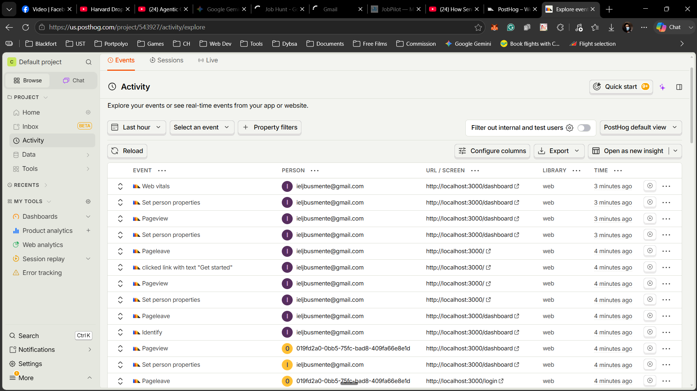

Based on [JS Mastery YT](https://github.com/jsmastery-pro/JobPilot)

# Landing Page

# `Get started` Clicked

## Continue with Google

## Logged in view

# PostHog Integration

# Documentation

[Opemfowok Documentation](https://docs.google.com/document/d/1e9yboPw9oIvU7eJp_jxbhPPD01pDFt6_BlV7MxTNFcE/edit?usp=sharing)
